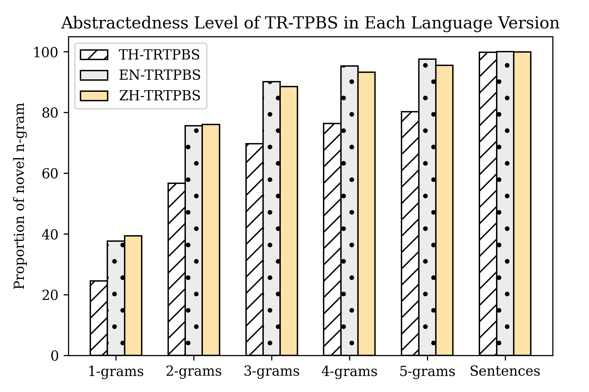

# TR-TPBS
Currently, the largest dataset for Thai text summarization.

## Download TR-TPBS Dataset
**TR-TPBS datasets are not made available yet. However, both of additional datasets are available to download below.**  
Click on file name to download. All files are in .csv format.
| File | Remark |
|--- |  --- |
|Original TR-TPBS| It contains full elements of TH-TRTPBS. |
|EN-TRTPBS|This file contains `en_body`, `en_summary`, `url`.|
|ZH-TRTPBS|This file contains `zh_body`, `zh_summary`, `url`.|
|Test Sets|This folder contains 2 files. </n> These files are the test set and validate set used in [cross lingual summarization experiment](#crosslingual-summarization) |

Use column `url` provided in ZH and EN TRTPBS files as the index to get its original Thai text in Original TR-TPBS.
### Additional Dataset
These two files are the previous versions of TR-TPBS, before being combined. Be noted that the articles in these files are preprocessed with slightly different filtering-out conditions of that TR-TPBS. The number in the end of datasets’ name indicates the approximate number of articles contained in each dataset. The newest articles contained in these two files are published online up to December 2019.
| File | Remark |Size |
|--- |  --- | --- |
|[Thairath-222k](https://drive.google.com/file/d/1L5XatRRS1aekfuhMVu24SQtOCCUrhj_W/view?usp=sharing)| contains `title`,	`body`,	`summary`,	`labels`,	`tags`,	`url` and `date` columns.| 1.72 GB |
|[ThaiPBS-111k](https://drive.google.com/file/d/1movJ5kjzhehD3OMtM9fPTS0VLaqd7oxK/view?usp=sharing)| contains similar columns as Thairath-222k’s except `date`. |0.51 GB| 

## Introduction
TR-TPBS is a medium-size dataset, a multi-purpose NLP benchmark, especially for Thai language. This dataset is crawled from Thairath (TR) and ThaiPBS (TPBS) news websites. The main objectives of this corpus are for Thai text summarization and cross-lingual Thai text summarization. The article texts and summary texts are translated to English and Chinese using Google & Amazon translation services. Therefore, there are three language versions of this dataset: TH-TRTPBS, ENG-TRTPBS and ZH-TRTPBS. The TH version is the original crawled Thai text. ENG and ZH stand for English and simplified Chinese respectively.

This dataset is the largest news dataset for Thai text summarization since the previous studies on this topic, as far as we know, used small size of dataset up to 500 documents. It was understandable, sine those studies were based on statistic methods not deep learning ones. It didn’t require a large text for training. Therefore, our experiment is the very first study that experimented Thai text summarization with deep learning methods on the largest Thai text summarization dataset. We explored this dataet on both extractive and abstractive methods. 

Apart from text summarization objectives, TR-TPBS can be used for several other NLP tasks e.g. news classification and keyphrase extraction. 

## Dataset Properties 
See [exploration.ipynb](https://github.com/nakhunchumpolsathien/TR-TPBS/blob/master/exploration.ipynb)

## Experiment Settings and Results
We evaluate the performance of the TR-TPBS dataset using existing extractive and abstractive baselines. 
Please refer to [PreSum](https://arxiv.org/pdf/1908.08345.pdf), also [BertSum](https://arxiv.org/pdf/1903.10318.pdf) for more technical information and their implementation codes. 
### Exeriment Settings
Both abstractive and extractive Bert-based summarization  models are trained on a single GPU (NVIDIA TITAN RTX).
##### Extractive settings
All BetSumExt models were trained for 100,000 steps with 6000 batch size. The rest of training settings are set identically to [BertSum](https://github.com/nlpyang/BertSum#model-training). It tooks approximately 80 hours to train each extractive model.
##### Abstractive Settings
All abstractive models were trained for 300,000 steps with 1120 batch size for Bert-based models and 1200 for Tranformers-based models. The rest of training settings are set identically to [PreSum](https://github.com/nlpyang/PreSumm#bertabs). It took approximately 150 hours to train each abstractive model.

More importantly, we used different versions of Bert for each language version of the dataset. The used Bert-based versions are stated below the result tables of each language. 
We strongly suggest to train all Bert-based models on multiple GUPs for shorten the training time and the better results. 

### Results
ROUGE F1 of R1 R2 and RL are used to reported these experimental results. 
#### Monolingual Summarization
##### TR-TPBS: (TH -> TH)

| Models | R1 | R2 | RL |
|--- | --- | --- | --- |
|**Extractive**| | | |
|Oracle | 35.06| 15.25 | 34.96 | 
|Lead-2 |30.77|13.66| 30.75 |
|BertSumExt| 44.58| 20.26 |	44.51|
| **Abstractive**| | | |
|BertSumAbs|	51.09| 26.92| 51.04 | 
|ertSumExtAbs|53.19|28.19|53.13|

> `bert-base-multilingual-uncased` (mBert)

#### Cross-lingual Summarisation  
ET and LT stand for early translation and late translation respectively. 
##### TR-TPBS: Thai -> English

| Models | R1 | R2 | RL |
|--- | --- | --- | --- |
|**Extractive**| | | |
|ET + Oracle | 	55.96| 	45.91	| 53.86| 
|ET + Lead-2	| 51.96| 42.15 | 50.18| 
|ET + BertSumExt| 51.85|	38.09	|49.50|
|BertSumExt + LT| 42.33| 27.33	| 34.85|
|**Abstactive**| | | |
|ET + BertSumAbs|  51.85|	31.06|	 47.09|
|ET + BertSumExtAbs|	 ||	 |
> `bert-base-uncased`
##### TR-TPBS: Thai -> Chinese
| Models | R1 | R2 | RL |
|--- | --- | --- | --- |
|**Extractive**| | | |
|ET + Oracle| 38.38|5.52| 38.02| 
|ET + Lead-2| 31.80|13.54| 31.57| 
|ET + BertSumExt| 34.58|14.98|31.57|
|BertSumExt + LT| 28.11| 11.85| 27.46|
|**Abstactive**| | | |
|ET + BertSumAbs| |||
|ET + BertSumExtAbs| || |
> `bert-base-chinese`

## Collected and Preposessed by 
- [Nakhun Chumpolsathien](https://github.com/nakhunchumpolsathien), School of Computer Science, Beijing Institute of Technology, China
- [Tanachat Ariyachutinan](https://github.com/caramelWaffle), School of Computer Science, Beijing Institute of Technology, China

## License 
These datasets are licensed under [MIT License](https://github.com/nakhunchumpolsathien/TR-TPBS/blob/master/LICENSE). 

## Examples of Generated Summary

**Article:** [ต่อลดราคาสีม่วงอีก 3 เดือน มติที่ประชุมบอร์ด รฟม.-BEM ไม่ปรับค่าโดยสารสีน้ำเงิน](https://www.thairath.co.th/news/local/bangkok/1867059)\
**Reference Summary (Gold Summary)**\
<q>ที่ประชุม บอร์ด มีมติ เห็นชอบ ให้ รฟม. ขยาย ระยะเวลา การ ปรับ ลด ค่าโดยสาร \<q> โครงการ รถไฟฟ้า สาย สีม่วง \<q> บาง ใหญ่ - เตา ปูน อัตรา 14 - 20 บาท จาก เดิม สิ้นสุด วันที่ 30 มิ.ย. นี้ ออก ไป อีก 3 เดือน

| Models | Results| 
|--- | --- |
| |**Monolingual Summarization**|
|mBertExt| บาง ใหญ่ - เตา ปูน อัตรา 14 - 20 บาท จาก เดิม สิ้นสุด วันที่ 30 มิ.ย. นี้ ออก ไป อีก 3 เดือน \<q> ธ.ค. นี้ ตาม มาตรการ ลด ค่าครองชีพ ให้ กับ ประชาชน โดย ไม่ สงวนสิทธิ์ ขอรับ การ ชดเชย แต่อย่างใด นาย ส รา วุธ กล่าวว่า เนื่องจาก สถานการณ์ โควิด - 19 ส่ง ผลกระทบ ต่อ ปริมาณ ผู้โดยสาร รถไฟฟ้า ไม่ ปกติ|
|mBertAbs | บอร์ด รฟม. เห็นชอบ ขยายเวลา ปรับ ลด ค่าโดยสาร \<q> บาง ใหญ่ - เตา ปูน อัตรา 14 - 20 บาท จาก เดิม สิ้นสุด วันที่ 30 มิ.ย. นี้ ออก ไป อีก 3 เดือน ตาม นโยบาย กระทรวงคมนาคม ที่ ต้องการ ลด ภาระ ค่าครองชีพ เพื่อ บรรเทา ความเดือดร้อน ให้ กับ ประชาช\<q>เดิศ\<q>ซึกโศร้อน\<q>ขณี\<q>สิษฐาน
|mBertExtAbs| บอร์ด รฟม. มีมติ เห็นชอบ ขยายเวลา ปรับ ลด ค่าโดยสาร \<q> บาง ใหญ่ - เตา ปูน ออก ไป อีก 3 เดือน ตาม นโยบาย คมนาคม ลด ภาระ ค่าครองชีพ เพื่อ บรรเทา ความเดือดร้อน ให้ ประชาชนซึ่ง \<q> จะ ครบกำหนด ปรับ ค่าโดยสาร ตาม สัญญา \<q>สัและ\<q> ครบัตรา\<q> สัตรา\<q> สัตรา
 || **Crosslingual Summarization: Thai to English** |
 |ET + BertSumAbs| mr. sarawut songsivilai , director-general of the department of highways , revealed after being the chairman of the board of directors meeting that the srt board has approved the extension of the fare reduction period for the mrt purple line bang yai - tao poon section . |
 |ET + BertSumExt|extended fare reduction period for mrt purple line bang yai - tao poon project at the rate of 14 - 20 baht from the end of 30 june .\<q> this is out for three months from july 1 .\<q>this measures to reduce the cost of living to the public without reserving the right to receive compensation whatsoever , mr. sarawuth said , because the situation of kovy - 19 affected the normal amount of train passengers .|
   || **Crosslingual Summarization: Thai to Chinese** |
  |ET + zhBertSumAbs|c. 这 一 措施 持续 到 6 月 底 。\<q>3 月 11 日 c. 泰国 公共 交通 管理 局 局长 帕邦斯里坎通 先生 在 会见 斯里坎 通后 透露 . 董 事 会 同意 从 3 月 底起 ， 将 紫线 票价 的 生活 费用 减少 到 14 - 20 泰 铢 的 措施 延长 到 3 个 月 。|
 
  
  
